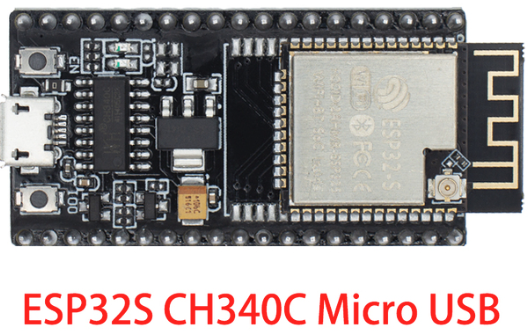
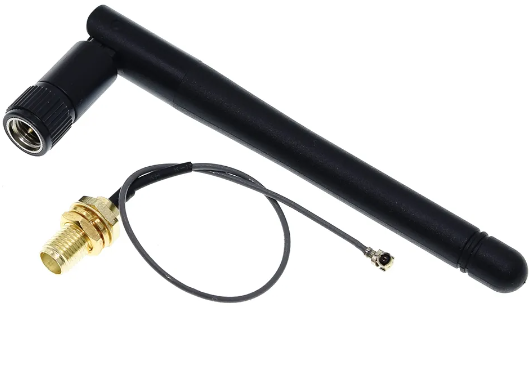

# 3D Case for Hoermann HCPBridge assembled on prototype PCB

## Electronic component
- ESP32S
  
- Antenna
  
- Step Down Power Supply Module Mini (set to 5V)
  
- RS485 to TTL converter
  
- 4P Screw PCB Terminal Block Connector
  
- flat cable
- RJ12 6P6C or 6P4C connector
- prototype PCB 70x50 mm
