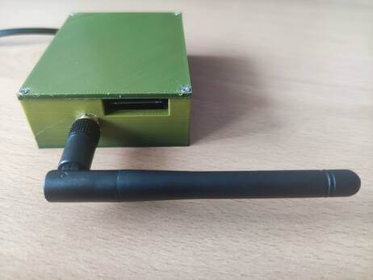

# 3D Case for Hoermann HCP Bridge assembled on prototype PCB

## Description
I created a simple case (body + lid) for Hoermann HCP Bridge based on the project https://github.com/Gifford47/HCPBridgeMqtt.

Due weak WiFi signal I needed to place the HCP Bridge out of Hoermann SupraMatic/ProMatic case.
My HCP Bridge is connected to the Hoermann motor with 5m flat data cable terminated with RJ12 6P6C connector.
To create the model I used the [OpenSCAD - The Programmers Solid 3D CAD Modeller](https://openscad.org/)

Feel free to modify the OpenSCAD source code of the [3D case](Hoerman-HCP_Bridge-case.stl).

## Electronic component
- ESP32S
  
- 2.4GHz WiFi 2.4g Antenna RP-SMA
  
- Step Down Power Supply Module Mini (set to 5V)
  
- RS485 to TTL converter
  
- prototype PCB 70x50 mm
  
- 4P Screw PCB Terminal Block Connector
- flat cable
- RJ12 6P6C or 6P4C connector

## Project photos
      

